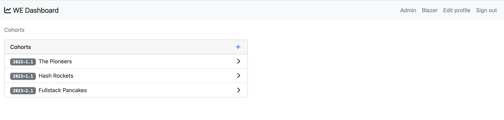

# How to Use the Workforce Education Dashboard
A Guide for Discovery Partners Institute Workforce Education Instructors and Administrators

## Overview
The workforce education dashboard provides a centralized view of apprentice progress, allowing instructors, administrators, employers, and other stakeholders to gain insights into their performance at DPI. With this guide, you will learn how to navigate the dashboard and leverage its features to track apprentice progress.

## Getting Started
To access the dashboard, go directly to [https://dashboard.dpi.dev/](https://dashboard.dpi.dev/). You will need login credentials to access the dashboard.

## Data Sources
We ingest data from multiple sources, including Piazza and Canvas Gradebook, to provide a comprehensive view of apprentice progress. As we continue to develop the dashboard, we plan to incorporate additional data sources such as interactions, attendance, and stand-ups.

## Features

### Apprentice Profiles
Each apprentice has a profile that provides a "baseball card" style view of their progress at DPI. This includes their name, profile image, cohort, link to their portfolio, a quote, their most recent role, education background, and an assessment of their progress.

### Reports and Charts
The dashboard includes reports and charts that can be used to gain insights into apprentice progress. For example, you can track their grades, attendance, and engagement over time to identify trends and areas for improvement.

### Blazer Insights
Blazer is a powerful tool that allows you to create charts, graphs, and alerts using raw SQL. With Blazer, you can track progress, monitor assignments, and analyze contributions. Please see [How to use Blazer](./how-to-use-blazer.md) for more details.

## Examples
Here are some examples of how to use the dashboard for common tasks or scenarios:

- Tracking apprentice progress over time
- Identifying areas where apprentices may need additional support
- Creating custom reports using Blazer

## Conclusion
The WE dashboard is a powerful tool that can help you gain insights into apprentice progress and identify areas for improvement. With this guide, you should be able to get started using the dashboard and leverage its features to improve outcomes for apprentices at DPI.